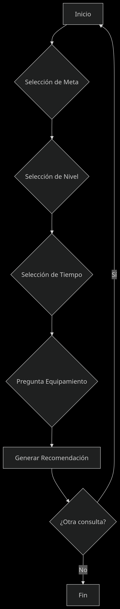

# SISTEMA EXPERTO PARA RECOMENDACIÓN DE EJERCICIOS FÍSICOS

## Introducción
Este sistema experto proporciona recomendaciones personalizadas de rutinas de ejercicio basadas en tres factores clave: meta del usuario, nivel de condición física y tiempo disponible. Desarrollado en Prolog, está diseñado para ayudar a personas sin experiencia en fitness a comenzar una rutina segura y efectiva, evitando ejercicios inapropiados que podrían llevar a lesiones o frustración.

## Estructura del Código

### Base de Conocimiento
#### Hechos Dinámicos:
- **meta/1**: Almacena la meta principal del usuario  
  Ej: `meta(perder_peso)`  
- **nivel/1**: Registra el nivel de experiencia  
  Ej: `nivel(principiante)`  
- **tiempo/1**: Guarda el tiempo disponible por sesión  
  Ej: `tiempo('20-30')`  
- **equipamiento/1**: Indica si tiene acceso a equipamiento básico  
  Ej: `equipamiento(si)`

#### Predicados Clave:
1. **leer_entrada_numero/4**:  
   Valida entradas numéricas con rango específico  
   ```prolog
   leer_entrada_numero('Opción', 1, 3, OpcionMeta)
2. **leer_entrada_sn/2**:  
   Valida respuestas Sí/No transformando a hechos si/no  
   ```prolog
   leer_entrada_sn('¿Tiene equipamiento?', Resp)
3. **lassert_meta/1, assert_nivel/1, assert_tiempo/1**:  
    Convierten opciones numéricas en hechos simbólicos   ```prolog
   leer_entrada_sn('¿Tiene equipamiento?', Resp)
### Motor de Inferencia
#### Reglas de Recomendación:

*  **5 reglas principales que combinan**:     ```prolog
   meta(X) ∧ nivel(Y) ∧ tiempo(Z) → recomendación
*  **1 regla de seguridad para principiantes**:  
#### Reglas de Recomendación:
Ejemplo de regla
```prolog
   recomendacion('Cardio de bajo impacto', 1) :-
    meta(perder_peso),
    nivel(principiante),
    tiempo('20-30').
 ```

#### Jerarquía de Reglas:
1. **Reglas de seguridad tienen prioridad**:  

2. **Se evalúan en orden de especificidad**:  

3. **lPrimera coincidencia válida detiene la búsqueda**:  

## Fujo del sistema
### Menu principal:
 ~~~
=== SISTEMA EXPERTO PARA RECOMENDAR EJERCICIOS ===

Seleccione su meta principal:
1. Perder peso
2. Ganar músculo
3. Mantenerse en forma
Opción (1-3): 
 ~~~

### Arquitectura del sistema


